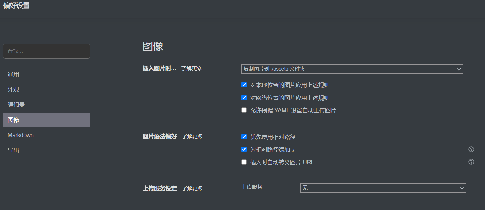

# Markdown 基础语法

### markdown 一种轻量级标记语言

学习网址：[https://markdown.com.cn/basic-syntax/](https://markdown.com.cn/basic-syntax/)

- 特点：简洁、高效、快速排版
- 后缀：`.md`

可与HTML混编，可导出 HTML、PDF 以及本身的 .md 格式的文件

### Typora 一款markdown编辑器、阅读器

# 标题语法

```markdown
# 一级标题
## 二级标题
###### 六级标题（最小的标题）
```

# 段落语法

```markdown
1. Typora 中直接回车就是分段
2. 不要使用空格`space`或制表符`Tab`缩进段落（即不要开头空格）
```

# 换行语法

```markdown
1、在一行的末端加2个空格后 + Enter 即可实现换行（但是Typora不支持该语法）

2、在Typora中，按住Shift + Enter 即可实现换行操作换行操作测试
```

# 强调语法

## 斜体（Italic）

在需要斜体的文本前后添加1个星号asterisk`*`或下划线underscore`_`，中间不带空格

```markdown
*星号斜体*
_下划线斜体_
```

## 粗体（Bold）

在需要加粗的文本前后各添加2个星号asterisk`**`或下划线underscore`__`，中间不带空格

```markdown
**星号加粗**
__下划线加粗__
```

## 斜粗体（Italic and Bold）

在需要加粗的文本前后各添加3个星号asterisk`***`或下划线underscore`___`，中间不带空格

```markdown
***星号斜粗体***
___下划线斜粗体___
```

## 删除线

若要删除单词，请在单词前后使用两个波浪号`~~`

```markdown
Paul ~~walker~~ Decker
```

# 代码语法

### 反引号

要将单词或短语表示为代码，请将其包裹在反引号 `` ` ``中

```markdown
		`代码`
```

### 转义反引号

如果你要表示为代码的单词或短语中包含一个或多个反引号，则可以通过将单词或短语包裹在双反引号````中

```markdown
 ``Use `code` in your Markdown file.``
```

### （围栏式）代码块

输入3个反引号````` 或3个波浪号~~~`即可创建代码块

~~~markdown
```html
<html>
	<head>
	</head>
</html>
```
~~~

```markdown
~ ~ ~java
public void test(){
    System.out.println("test");
}
~ ~ ~
```

输入3个反引号`` ``` ``或3个波浪号`~~~`后+指定语言，即可高亮

# 列表语法

## 无序列表

要创建无序列表，请在每个列表项前面添加破折号 `-`、星号 `*` 或加号 `+` 

中间需要空格
缩进一个或多个列表项可创建嵌套列表

```markdown
- 使用破折号的First Item
- Second Item
- - 列表可以二级嵌套
  - - 多级嵌套

* 使用星号的first item
* second item
* - 不同符号间也可以嵌套

+ 使用加号的First Item
+ Second Item
```

>  相当于`<ul><li></li></ul>`


## 有序列表

数字不必按数学顺序排列，但是列表应当以数字 1 起始

```markdown
1. 以任意数字 + 英文句号"." 开头
2. 中间需要有空格
5. 测试可以从任意数字开始
```

## 任务列表

`- [ ]`创建任务列表（括折号，空格，中括号，空格，中括号）

```markdown
- [ ] 任务列表
- [x] 可以单击前面的复选框
- [x] 完成
- [ ] 未完成
```

# 引用语法

要创建块引用，需要在段落前添加 `>` 符号

```markdown
> 效果如下
>
> > 块引用中的二级块引用（即嵌套块引用）
> >
> > 块引用中可以包含部分其他Markdown 格式的元素
> >
> > 例如：
> > ***斜粗体***
> >
> > - 无序列表
> > - 但也只是部分语法可以在块引用中使用
> >
> > ```
> > 嵌套代码块
> > ```
```

# 分割线语法

要创建分隔线，请在单独一行上使用3个或多个星号 `***`、破折号 `---` 或下划线 `___` ，并且不能包含其他内容

```markdown
***

---

___
```

# 链接语法

链接文本放在中括号内，链接地址放在后面的括号中，链接title可选

【超链接Markdown语法格式】

```markdown
[超链接显示名](超链接地址 "超链接title")
```

>  ```对应的HTML代码：<a href="超链接地址" title="超链接title">超链接显示名</a>```


```markdown
这是一个链接[Markdown 语法](https://markdown.com.cn "官方markdown教程")。
需要按住Ctrl+鼠标右键点击才能跳转页面
```

## 网址和Email地址

使用尖括号可以很方便地把URL或者email地址变成可点击的链接

```markdown
<https://www.bing.com>
<1710762442@qq.com>
```

## 带格式化的链接（修饰链接）

```markdown
斜体：*[链接](https://www.bing.com)*
粗体：**[链接](https://www.bing.com)**
显示为代码：[`链接`](https://www.bing.com)
```

## 引用类型链接

**链接第一部分：**

第一组方括号包围应显示为链接的文本。

第二组括号显示了一个标签，该标签用于指向您存储在文档其他位置的链接。

第二组括号中的标签不区分大小写，可以包含字母，数字，空格或标点符号。

```markdown
 [bing][1]
```

**链接第二部分：**

1. 放在括号中的标签，其后紧跟一个冒号和至少一个空格（例如`[label]:`）。
2. 链接的URL，可以选择将其括在尖括号中。
3. 链接的可选标题，可以将其括在双引号，单引号或括号中。

```markdown
[1]: https://www.bing.com
```

以下示例格式对于链接的第二部分效果相同：

```markdown
- `[1]: https://en.wikipedia.org/wiki/Hobbit#Lifestyle`
- `[1]: https://en.wikipedia.org/wiki/Hobbit#Lifestyle "Hobbit lifestyles"`
- `[1]: https://en.wikipedia.org/wiki/Hobbit#Lifestyle 'Hobbit lifestyles'`
- `[1]: https://en.wikipedia.org/wiki/Hobbit#Lifestyle (Hobbit lifestyles)`
- `[1]: <https://en.wikipedia.org/wiki/Hobbit#Lifestyle> "Hobbit lifestyles"`
- `[1]: <https://en.wikipedia.org/wiki/Hobbit#Lifestyle> 'Hobbit lifestyles'`
- `[1]: <https://en.wikipedia.org/wiki/Hobbit#Lifestyle> (Hobbit lifestyles)`
```

# 图片语法

【插入图片Markdown语法格式】

```markdown

```

>  对应的HTML代码：


alt 属性是一个必需的属性，它规定在图像无法显示时的替代文本

【例】

```markdown

```

## 链接图片

给图片增加链接，请将图像的Markdown 括在方括号中，然后将链接添加在圆括号中

```markdown
[](https://www.bing.com)
```

## 注意！！

一般来说，插入md文件的图片，都是引用图片的本地路径或网络路径的URL

并没有真正的将图片插入到md文件中

所以，如果引用的是本地路径，当上传md文件到类似知乎平台时，是显示不出图片的

### 方法1：

在文件→偏好设置→图像中，选择

插入图片时→复制图片./assets文件夹

同时勾选对本地位置的图片应用上诉规则、对网络位置的图片应用上诉规则

勾选优先使用相对路径和为相对路径添加./（以便上传到GitHub后可以正常打开）



这种方法适合图片较少、没有发布到其他平台的需求

如果需要发布到知乎、公众号等平台，就需要一张张单独上图片

### 方法2：利用图床

使用PicGo（图片上传工具）、图床

图床：指的是存储图片的服务器

当你配置好该功能后，就可以将图片托管在网络上，此时再把Markdown文档中的内容复制到知乎、公众号这类平台，无论是文字还是图片，都可以正常显示

具体配置参考如下：[点我直达](https://link.zhihu.com/?target=https%3A//post.m.smzdm.com/p/aqn9dkkk/)

# 表格语法

输入`|表头1|表头2|...`创建表格

```markdown
| 表头1 | 表头2 | 表头3 |
| ----- | :---: | ----: |
|       |       |       |
```

创建表格语法比较复杂，可以通过网站[https://www.tablesgenerator.com/markdown_tables#](https://www.tablesgenerator.com/markdown_tables#)创建好表格后，将表格语法复制过去
